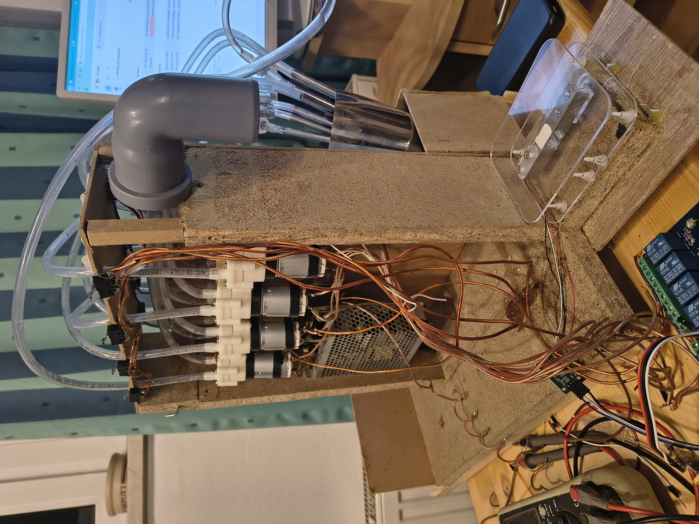
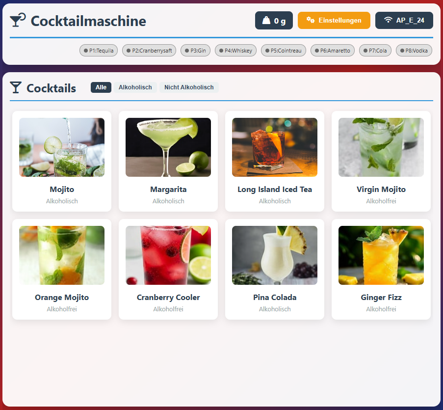
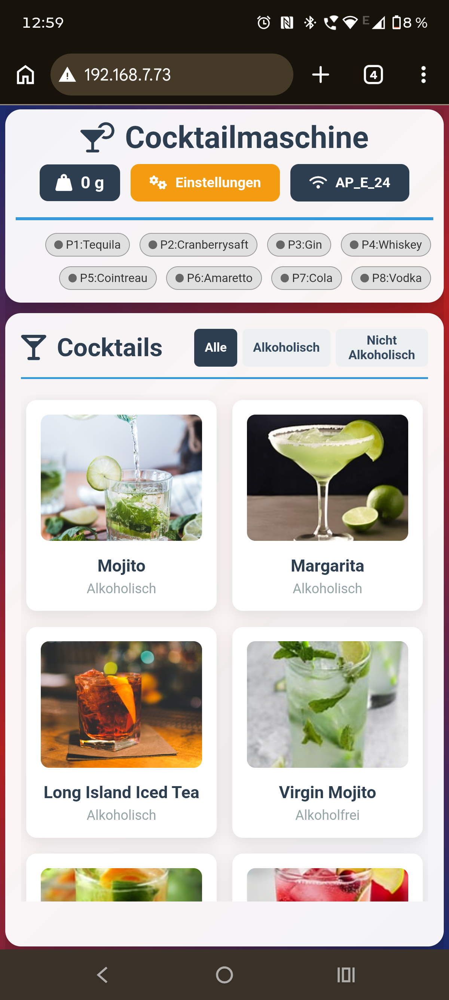
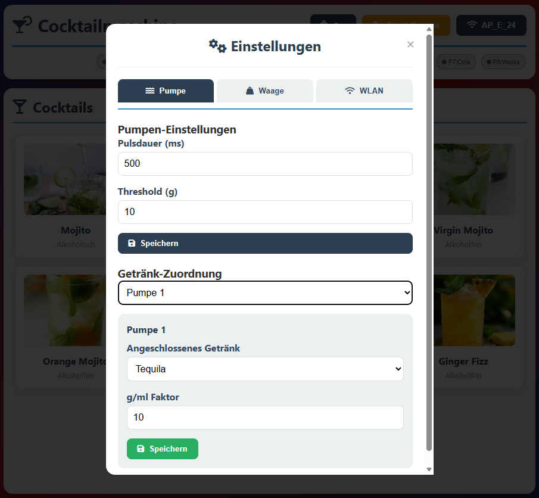
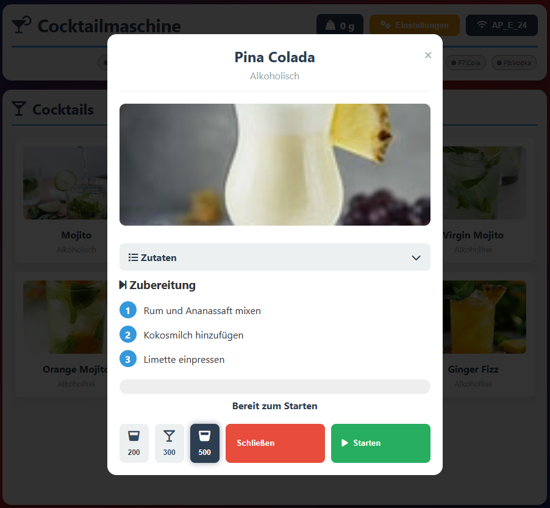

# Cocktail-machine on budget

## Goal:
Goal is to build a very cheep but also good cocktailmachine with a Webinterface where you
can chosse from predefined Cocktails. Project is based on ESP32 - Dispension is controlled
by the HC711 which can deliver accurate dispension (~2ml deviation with swing-compensation).

## Hint:
This Project is in a early development-stage.
feel free to contribute code or cocktail recipes.

Web-Interface (Desktop and Mobile) View:

Dialogs for Cocktail and Settings:

## Hardware

### For this Cocktail-machine to build you need:

- 8 Pumps (12 V) - they also work with 5V    https://de.aliexpress.com/item/1005005792284115.html    32€
- Releais-Board (8 Port, ESP32-WROOM)        https://de.aliexpress.com/item/1005003999413945.html    15€
- HC711 Measurement kit 5kG                  https://de.aliexpress.com/item/1005009135360961.html    6€
- Power Unit (also USB-Powerbank possible)   https://www.led-universum.de/1000138697                 5€

### Additionall parts:
- Cables (Loudspeaker cables), 
- USB Flashing Device (once for ESP until we have OTA),   UART-TTL USB CH340G Adapter with 3.3V Support
- Pipes (8 Meters, 1.5cm),                  
- some wood (old wardrobe is good to have)  
- HT-90° Pipe for outlet (or 3D printed)    https://www.bauhaus.info/ht-rohre/ht-bogen/p/13625011

### Extension-Parts:
- Micro-Switches (If you want manual pump control (recommended))

## Tools needed
- Drill 
- Cutter-Knife
- Screwdriver
- Hot-Glue
- Soldering machine

# Setup

- Clone this repo and open in Visual Studio Code (with PlaformIO installed)
- Connect your ESP32 Relais Board via USB (use 3.3V!)
- Find your Serial Port
- Flash device (Press and Hold EN while Reset)
- On first flash ESP will be in AP-Mode.
- Connect to the Wifi of the Cocktail-machine and connect to your home-wifi!
- After reboot note the IP-Adress assigned from DHCP (In Logging) (for OTA-Updates)

# Use:
Make sure you are in the same Network as the ESP. the Network MUST have internet access
because the cocktail-images are not stored locally.
Open the IP-Adress of your Cocktail machine and setup the pump-pressure value
and the connected liquids. please do not connect sparkling liquids - it will not work!
Go to the main-page and select your cocktail. make sure you have a glass on the measurement-unit.
